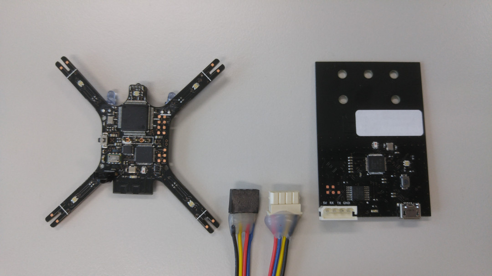
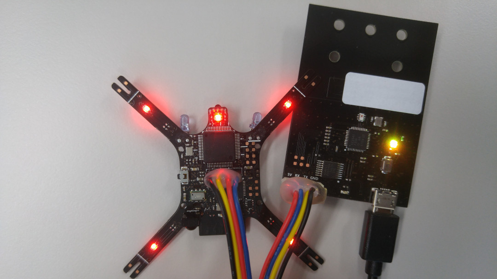
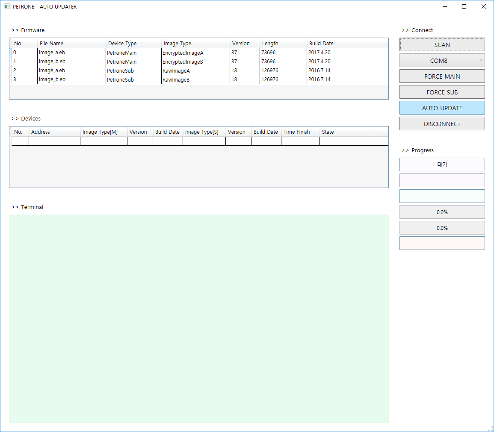
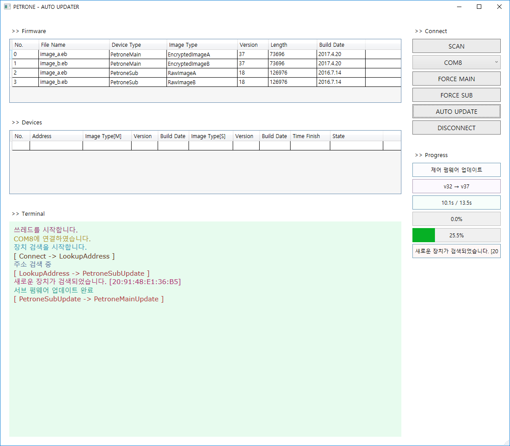
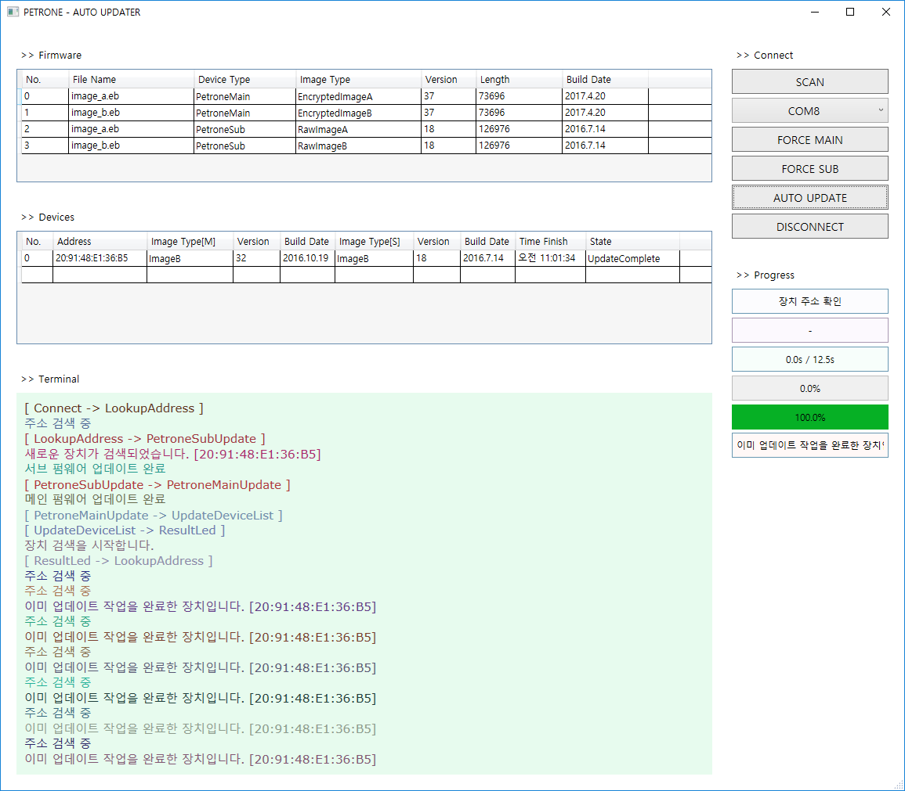

# Auto Updater

 

## 1. Petrone과 PetroneLink를 유선으로 연결할 때 사용하는 커넥터

 
 

## 2. Petrone과 PetroneLink를 연결한 상태

 
 

## 3. Auto Updater 프로그램을 실행한 화면

|이름      |  설명                                |
|:-------:|:-----------------------------------|
| SCAN | PC에 연결된 시리얼 통신 장치 검색 |
| FORCE MAIN | 메인 펌웨어 강제 업데이트 |
| FORCE SUB | 통신 펌웨어 강제 업데이트 |
| AUTO UPDATE | 펌웨어 업데이트 시작 |
| DISCONNECT | 펌웨어 업데이트 중단. PetroneLink와의 연결 해제 |

- PetroneLink 모듈을 PC에 연결한 후 화면 우측 상단의 'SCAN' 버튼을 누르면 바로 아래의 콤보 박스에 검색된 시리얼 포트가 표시됨.
- PetroneLink는 LED가 노란색으로 Dimming 되는 상태로 둘 것.
- 시리얼 통신 장치 중 마지막에 연결한 장치가 가장 아래에 표시됨.
- AUTO UPDATE 버튼을 누르면 해당 포트에 연결한 Petrone의 펌웨어 업데이트를 시작.
- 펌웨어 업데이트 시 업데이트가 필요한 경우에만 펌웨어 업데이트를 실행함.
- 버젼과 상관없이 강제로 펌웨어를 업데이트하려면 'FORCE MAIN'(메인 펌웨어) 또는 'FORCE SUB'(통신 펌웨어) 버튼을 눌러 활성화해야 함.
- 하나의 Petrone 펌웨어를 업데이트하고 나서 업데이트 된 Petrone을 제거하고, 새로운 Petrone을 연결하면 연속해서 펌웨어 업데이트를 실행.
- 'Disconnect' 버튼을 누르면 PetroneLink와의 연결을 끊음.
- 펌웨어 업데이트는 통신 펌웨어 -> 메인 펌웨어 순서로 진행됨.
- 업데이트 프로그램을 실행할 때에는 [.Net Framework 4.0](https://www.microsoft.com/en-us/download/details.aspx?id=17851)이 필요.
- PetroneLink를 PC와 연결할 때에는 CP2104용 드라이버가 필요. [CP210x USB to UART Bridge VCP Drivers](https://www.silabs.com/products/mcu/Pages/USBtoUARTBridgeVCPDrivers.aspx)

 
 

## 4. 펌웨어 업데이트를 진행하고 있는 화면.

 
 

## 5. 펌웨어 업데이트가 완료된 화면.

 

---

Modified : 2017.05.10
